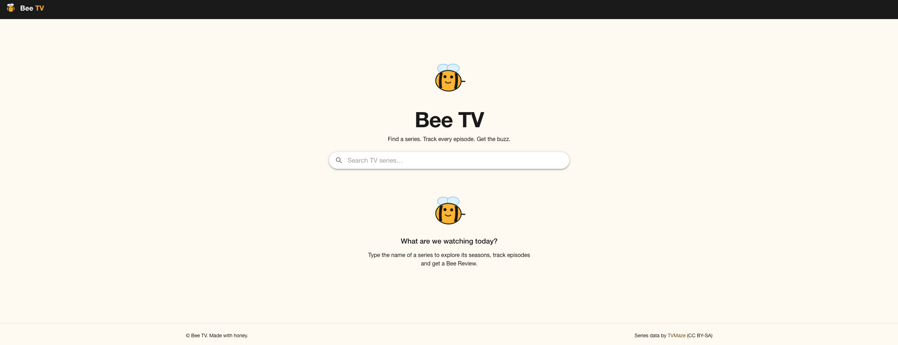
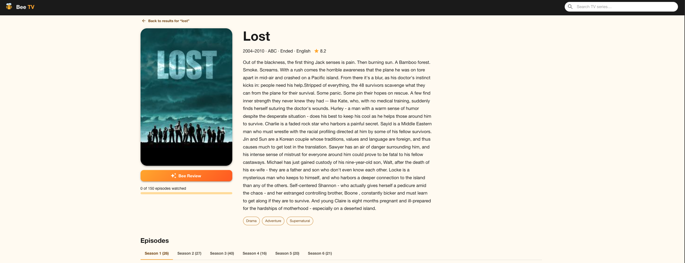
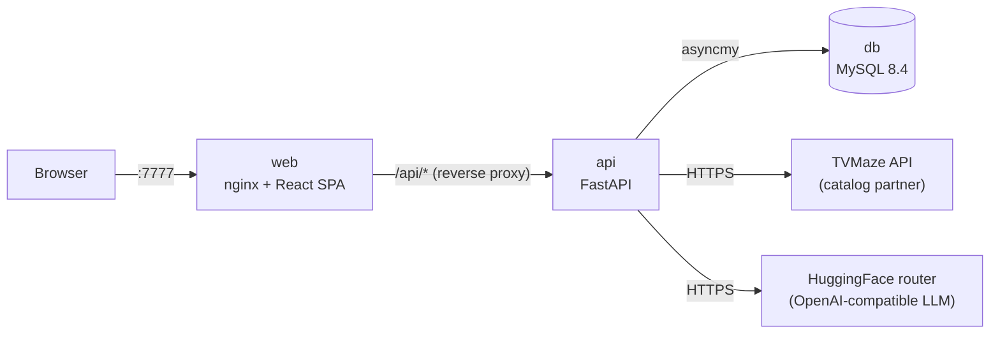

# Bee TV

A smart streaming companion for your favorite TV series: search the catalog, explore seasons,
track watched episodes, discuss them, and get an AI-powered **Bee Review**.


---


**There is a demo [here](./docs/media/bee-tv-intro.mov)!** (_.mov_ format)

## Quick start

Requirements: **Docker** and Docker Compose. `docker-compose.yml` uses **Compose file format 3.3**:
it runs on Docker Compose v2 (`docker compose`) and on legacy `docker-compose` v1 (1.17+).

```bash
docker compose up --build
```

Open **http://localhost:7777**. That's it: the database, schema migrations, API and web app
start in order, and each service handles its own readiness (see [Startup and readiness](#startup-and-readiness)).
The first build takes about a minute.

| Command | Purpose |
| --- | --- |
| `docker compose up --build -d --wait` | Start detached and return once every service is healthy (`--wait` is Compose v2 only) |
| `docker compose logs -f api` | Follow API logs |
| `docker compose down` | Stop (data is kept in the `db-data` volume) |
| `docker compose down -v` | Stop **and delete all data** |

With legacy Compose v1, use `docker-compose` in place of `docker compose`.

### Optional configuration

Every setting has a working default. To customize, copy `.env.example` to `.env`:

| Variable | Default | Description |
| --- | --- | --- |
| `BEE_WEB_PORT` | `7777` | Host port of the web application |
| `BEE_API_PORT` | `8000` | Port the backend API listens on (nginx upstream and healthcheck follow it) |
| `MYSQL_DATABASE` / `MYSQL_USER` / `MYSQL_PASSWORD` | `beetv` | Application database and credentials (URL-safe characters) |
| `MYSQL_ROOT_PASSWORD` | `beetv-root` | MySQL root password |
| `HF_TOKEN` | *(empty)* | HuggingFace token enabling AI Bee Reviews ([create one](https://huggingface.co/settings/tokens) with *Make calls to Inference Providers*) |
| `BEE_INSIGHT_MODEL` | `meta-llama/Llama-3.1-8B-Instruct` | Chat model used for Bee Reviews |
| `BEE_INSIGHT_API_BASE_URL` | `https://router.huggingface.co/v1` | Any OpenAI-compatible endpoint (OpenAI, Groq, Together, Ollama, vLLM…) |
| `BEE_LOG_LEVEL` | `INFO` | API log level |

Without `HF_TOKEN`, Bee Review still works using its offline rule-based engine, and the UI says so.

## Architecture

Two tiers: a RESTful backend and a Single-Page Application, deployed as one container per
deployable, plus MySQL.



| Service | Image | Notes |
| --- | --- | --- |
| `web` | `src/bee-tv-app/Dockerfile` (Bun + Vite build, then unprivileged nginx) | Serves the SPA on **:7777**, proxies `/api` to `api` (same origin: no CORS), strict security headers |
| `api` | `src/bee-tv-api/Dockerfile` (uv build, then slim Python 3.13, non-root) | Runs migrations, then uvicorn on `BEE_API_PORT` (default 8000, internal only) |
| `db` | `mysql:8.4` (LTS) | Persistent named volume `db-data`; not published to the host |

### Startup and readiness

File format 3.3 has no `depends_on` health conditions, so `depends_on` only orders start-up
(`db`, then `api`, then `web`). Each service tolerates a dependency that isn't ready yet:

- **`api` waits for MySQL:** `python -m app.migrate` retries the connection (up to 30 attempts,
  2 s apart) before applying migrations and starting the server.
- **`web` resolves the API lazily:** nginx resolves the `api` hostname per request, not once at
  start-up. It starts even if the API isn't up yet (requests get a 502 for those few seconds,
  shown as the app's friendly "try again" state). It also follows the API container when it is
  recreated with a new IP.
- **Health checks** are still defined for every service, so `docker compose ps`, `--wait` and
  orchestrators report real health.

### Backend (`src/bee-tv-api`)

Python 3.13 and FastAPI with **Vertical Slice Architecture**. Each feature under
`app/features/` is self-contained, and its use case lives in the endpoint handler:
`search`, `show_details`, `watch_tracking`, `comments`, `bee_review` and `health`.

- **Vendor lock-in proofing.** TVMaze sits behind the `CatalogProvider` port
  (`app/integrations/catalog`). The adapter translates partner payloads into Bee TV models
  (an anti-corruption layer), and a caching decorator is added at composition time. It also has
  retry with backoff and a circuit breaker.
- **AI isolation.** Bee Review depends on the `InsightGenerator` interface. An OpenAI-compatible
  LLM adapter is chained with a deterministic rule-based fallback. Any failure (outage, quota,
  malformed output, open circuit) degrades gracefully, and each response reports its `source`
  (`ai` or `fallback`).
- **Error handling.** Global exception handlers produce RFC 9457 `application/problem+json`
  responses. Partner or database outages return 503, never a stack trace.
- **Auth.** Authentication is out of MVP scope, so a mocked *guest* user is injected through a
  single dependency.

### Frontend (`src/bee-tv-app`)

TypeScript and React 19 on the **Bun** runtime, built by **Vite**, with **MUI** as the design system.

- **Feature folders.** `src/features/` holds search, show-details, watch-tracking, comments and
  bee-review. Features never import each other; ESLint enforces this. `src/pages/` composes
  them through slots.
- **Server state.** TanStack Query retries only transient failures. Watched toggles update
  optimistically and roll back on error.
- **Errors.** Creative, mascot-driven error and empty states for every failure class.
- **Accessibility.** Basic a11y is gated by `eslint-plugin-jsx-a11y`.

## Database schema deployment

The schema is versioned with **Alembic** (SQLAlchemy's migration tool) in
`src/bee-tv-api/migrations/`. On every start the API container runs `python -m app.migrate`,
which:

1. waits for MySQL with bounded retries (in addition to the Compose health gate), then
2. applies pending migrations with `alembic upgrade head`. This is idempotent: a no-op when up to date.

Useful operations:

```bash
# Current revision
docker compose exec api alembic current
# Migration history
docker compose exec api alembic history
# Open a MySQL shell
docker compose exec db sh -c 'mysql -u"$MYSQL_USER" -p"$MYSQL_PASSWORD" "$MYSQL_DATABASE"'
```

Creating a new migration (local development, see below):

```bash
cd src/bee-tv-api
uv run alembic revision --autogenerate -m "describe the change"   # review the generated file!
```

> **Scaling note:** migrating at container start is ideal for a single API replica (the MVP).
> With several replicas, run migrations as a one-off release job instead and start the API with
> `BEE_SKIP_MIGRATIONS=true`.

## Operations

| Endpoint | Purpose |
| --- | --- |
| `GET /healthz` (web) | nginx liveness |
| `GET /api/health` | API liveness and database readiness (`503` + `degraded` when MySQL is down) |
| `GET /api/docs` | Interactive OpenAPI documentation |

- Logs go to stdout (12-factor). Every API request is logged with method, path, status,
  latency and an `X-Request-ID`. nginx generates that ID and returns it to clients.
- Containers run as non-root users, and only the web port (`BEE_WEB_PORT`, default 7777) is exposed on the host.
- The services recover by themselves: after a database restart the API reconnects
  (pool pre-ping). After a partner outage, the circuit breakers close again automatically.

### Troubleshooting

| Symptom | Fix |
| --- | --- |
| `port is already allocated` | Set `BEE_WEB_PORT` in `.env` to a free port |
| Bee Review always shows *Bee's instinct* | `HF_TOKEN` is missing or invalid, or the model is unavailable. Check `docker compose logs api` |
| Changed MySQL credentials don't apply | MySQL only reads them on first init. Run `docker compose down -v` (**deletes data**) |

## Quality gate

Tests are a **mandatory gate for every build**. Each Dockerfile has a `test` stage, and an image
can only be produced after it passes. There is no bypass switch, so any failure aborts
`docker compose up --build`.

| Image | Gate (in order) |
| --- | --- |
| `api` | `ruff check`, `ruff format --check`, `mypy` (strict), `pytest` with coverage ≥ 95% |
| `web` | ESLint (feature boundaries + a11y), `tsc`, Vitest with coverage thresholds (95% lines/statements/functions, 90% branches) |

The suites include unit tests and integration tests. Backend integration tests exercise the HTTP
API end to end through the ASGI app, run repositories against a real SQL engine, and run the
Alembic migrations. Frontend integration tests render whole pages with routing and providers.
External partners (TVMaze, LLM) are faked, so the gate is deterministic and needs no credentials.

How it's wired:
- **SPA:** the bundle is built `FROM test`, so it cannot exist without a passing gate.
- **API:** the runtime image copies the gate's report (`/app/quality-gate.txt`), which forces
  BuildKit to run the stage. Dev tooling never reaches the runtime image.

BuildKit caches the gate layer only while its inputs are byte-identical. Any source or test
change re-runs it. To run the gate alone (e.g. in CI):

```bash
docker build --target test src/bee-tv-api
docker build --target test src/bee-tv-app
```

## Local development

Backend (requires [uv](https://docs.astral.sh/uv/)):

```bash
cd src/bee-tv-api
uv sync
uv run ruff check . && uv run ruff format --check . && uv run mypy   # lint, format, types (strict)
uv run pytest --cov                                                  # unit tests
BEE_DATABASE_URL="sqlite+aiosqlite:///./dev.db" uv run python -m app.migrate
BEE_DATABASE_URL="sqlite+aiosqlite:///./dev.db" uv run python -m app   # listens on BEE_API_PORT (default 8000)
```

Frontend (requires [Bun](https://bun.sh)):

```bash
cd src/bee-tv-app
bun install
bun run lint && bun run typecheck   # ESLint (boundaries + a11y) and TypeScript
bun run test:coverage               # Vitest + Testing Library
bun run dev                         # http://localhost:7777, proxies /api to localhost:$BEE_API_PORT (default 8000)
```

## Repository layout

```
docker-compose.yml       one-command orchestration
.env.example             optional configuration
docs/                    product specification and technical requirements
src/bee-tv-api/          backend: FastAPI, Alembic migrations, Dockerfile
src/bee-tv-app/          frontend: React SPA, nginx config, Dockerfile
```

## Data attribution

TV series data is provided by [TVMaze](https://www.tvmaze.com) under
[CC BY-SA 4.0](https://creativecommons.org/licenses/by-sa/4.0/).

## AI-Assisted Engineering

This current implementation was created with the support of the GitHub Copilot and Claude family models. The original files which have been written without AI assitance are under _docs_ folder (except the human-reviewed [_paterns and choices_](./docs/patterns-and-choices.md)). A specification-first approach was used to **understand the requirements**, **think about the solution** (_ideation_), and **establish principles and drivers**, especially the technical ones. They are _"macro-decisions"_ which support the derivation of well-adhered implementation decisions (i.e, _Repository Pattern_, _Interfaces for reasonable abstractions_, _unusual error-handling relying over intentioned fallback experiences_, etc).

A strong reason to use AI-Engineering has been **greater quality**, **the real-world scenario** that demands heavy AI usage by IT professionals, and the **level of my experience** not only in software and clear-conscious decisions but with AI-Assisted engineering.