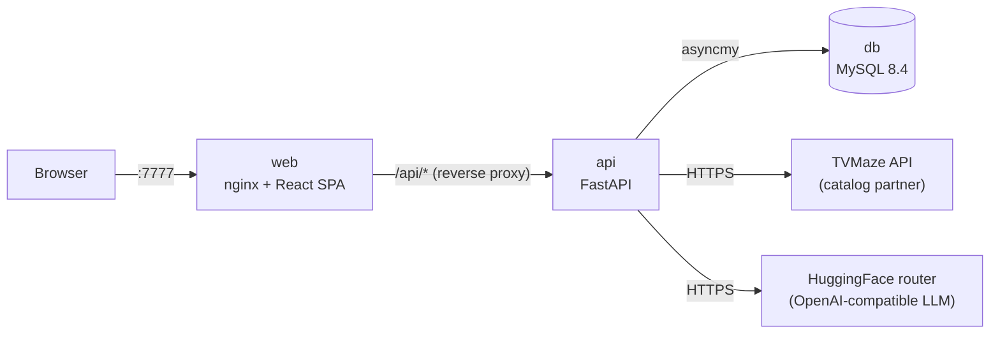

# Bee TV

A smart streaming companion for your favorite TV series: search the catalog, explore seasons,
track watched episodes, discuss them, and get an AI-powered **Bee Review**.

## Quick start

Requirements: **Docker** with the Compose plugin (Docker Desktop, or Docker Engine 24+ and Compose v2).

```bash
docker compose up --build
```

Open **http://localhost:7777**. That's it: the database, schema migrations, API and web app
start in the right order, gated by health checks. First build takes about a minute.

| Command | Purpose |
| --- | --- |
| `docker compose up --build -d --wait` | Start detached and return once every service is healthy |
| `docker compose logs -f api` | Follow API logs |
| `docker compose down` | Stop (data is kept in the `db-data` volume) |
| `docker compose down -v` | Stop **and delete all data** |

### Optional configuration

Every setting has a working default. To customize, copy `.env.example` to `.env`:

| Variable | Default | Description |
| --- | --- | --- |
| `BEE_WEB_PORT` | `7777` | Host port of the web application |
| `BEE_API_PORT` | `8000` | Port the backend API listens on (nginx upstream and healthcheck follow it) |
| `MYSQL_DATABASE` / `MYSQL_USER` / `MYSQL_PASSWORD` | `beetv` | Application database and credentials (URL-safe characters) |
| `MYSQL_ROOT_PASSWORD` | `beetv-root` | MySQL root password |
| `HF_TOKEN` | *(empty)* | HuggingFace token enabling AI Bee Reviews ([create one](https://huggingface.co/settings/tokens) with *Make calls to Inference Providers*) |
| `BEE_INSIGHT_MODEL` | `meta-llama/Llama-3.1-8B-Instruct` | Chat model used for Bee Reviews |
| `BEE_INSIGHT_API_BASE_URL` | `https://router.huggingface.co/v1` | Any OpenAI-compatible endpoint (OpenAI, Groq, Together, Ollama, vLLM…) |
| `BEE_LOG_LEVEL` | `INFO` | API log level |

Without `HF_TOKEN`, Bee Review still works using its offline rule-based engine, and the UI says so.

## Architecture

Two tiers: a RESTful backend and a Single-Page Application, deployed as one container per
deployable, plus MySQL.



| Service | Image | Notes |
| --- | --- | --- |
| `web` | `src/bee-tv-app/Dockerfile` (Bun + Vite build, then unprivileged nginx) | Serves the SPA on **:7777**, proxies `/api` to `api` (same origin: no CORS), strict security headers |
| `api` | `src/bee-tv-api/Dockerfile` (uv build, then slim Python 3.13, non-root) | Runs migrations, then uvicorn on `BEE_API_PORT` (default 8000, internal only) |
| `db` | `mysql:8.4` (LTS) | Persistent named volume `db-data`; not published to the host |

Startup order: `db` healthy, then `api` (migrations applied, `/api/health` green), then `web` healthy.

### Backend (`src/bee-tv-api`)

Python 3.13 and FastAPI with **Vertical Slice Architecture**. Each feature under
`app/features/` is self-contained, and its use case lives in the endpoint handler:
`search`, `show_details`, `watch_tracking`, `comments`, `bee_review` and `health`.

- **Vendor lock-in proofing.** TVMaze sits behind the `CatalogProvider` port
  (`app/integrations/catalog`). The adapter translates partner payloads into Bee TV models
  (an anti-corruption layer), and a caching decorator is added at composition time. It also has
  retry with backoff and a circuit breaker.
- **AI isolation.** Bee Review depends on the `InsightGenerator` interface. An OpenAI-compatible
  LLM adapter is chained with a deterministic rule-based fallback. Any failure (outage, quota,
  malformed output, open circuit) degrades gracefully, and each response reports its `source`
  (`ai` or `fallback`).
- **Error handling.** Global exception handlers produce RFC 9457 `application/problem+json`
  responses. Partner or database outages return 503, never a stack trace.
- **Auth.** Authentication is out of MVP scope, so a mocked *guest* user is injected through a
  single dependency.

### Frontend (`src/bee-tv-app`)

TypeScript and React 19 on the **Bun** runtime, built by **Vite**, with **MUI** as the design system.

- **Feature folders.** `src/features/` holds search, show-details, watch-tracking, comments and
  bee-review. Features never import each other; ESLint enforces this. `src/pages/` composes
  them through slots.
- **Server state.** TanStack Query retries only transient failures. Watched toggles update
  optimistically and roll back on error.
- **Errors.** Creative, mascot-driven error and empty states for every failure class.
- **Accessibility.** Basic a11y is gated by `eslint-plugin-jsx-a11y`.

## Database schema deployment

The schema is versioned with **Alembic** (SQLAlchemy's migration tool) in
`src/bee-tv-api/migrations/`. On every start the API container runs `python -m app.migrate`,
which:

1. waits for MySQL with bounded retries (in addition to the Compose health gate), then
2. applies pending migrations with `alembic upgrade head`. This is idempotent: a no-op when up to date.

Useful operations:

```bash
# Current revision
docker compose exec api alembic current
# Migration history
docker compose exec api alembic history
# Open a MySQL shell
docker compose exec db sh -c 'mysql -u"$MYSQL_USER" -p"$MYSQL_PASSWORD" "$MYSQL_DATABASE"'
```

Creating a new migration (local development, see below):

```bash
cd src/bee-tv-api
uv run alembic revision --autogenerate -m "describe the change"   # review the generated file!
```

> **Scaling note:** migrating at container start is ideal for a single API replica (the MVP).
> With several replicas, run migrations as a one-off release job instead and start the API with
> `BEE_SKIP_MIGRATIONS=true`.

## Operations

| Endpoint | Purpose |
| --- | --- |
| `GET /healthz` (web) | nginx liveness |
| `GET /api/health` | API liveness and database readiness (`503` + `degraded` when MySQL is down) |
| `GET /api/docs` | Interactive OpenAPI documentation |

- Logs go to stdout (12-factor). Every API request is logged with method, path, status,
  latency and an `X-Request-ID`. nginx generates that ID and returns it to clients.
- Containers run as non-root users, and only the web port (`BEE_WEB_PORT`, default 7777) is exposed on the host.
- The services recover by themselves: after a database restart the API reconnects
  (pool pre-ping). After a partner outage, the circuit breakers close again automatically.

### Troubleshooting

| Symptom | Fix |
| --- | --- |
| `port is already allocated` | Set `BEE_WEB_PORT` in `.env` to a free port |
| Bee Review always shows *Bee's instinct* | `HF_TOKEN` is missing or invalid, or the model is unavailable. Check `docker compose logs api` |
| Changed MySQL credentials don't apply | MySQL only reads them on first init. Run `docker compose down -v` (**deletes data**) |

## Local development

Backend (requires [uv](https://docs.astral.sh/uv/)):

```bash
cd src/bee-tv-api
uv sync
uv run ruff check . && uv run ruff format --check . && uv run mypy   # lint, format, types (strict)
uv run pytest --cov                                                  # unit tests
BEE_DATABASE_URL="sqlite+aiosqlite:///./dev.db" uv run python -m app.migrate
BEE_DATABASE_URL="sqlite+aiosqlite:///./dev.db" uv run python -m app   # listens on BEE_API_PORT (default 8000)
```

Frontend (requires [Bun](https://bun.sh)):

```bash
cd src/bee-tv-app
bun install
bun run lint && bun run typecheck   # ESLint (boundaries + a11y) and TypeScript
bun run test:coverage               # Vitest + Testing Library
bun run dev                         # http://localhost:7777, proxies /api to localhost:$BEE_API_PORT (default 8000)
```

## Repository layout

```
docker-compose.yml       one-command orchestration
.env.example             optional configuration
docs/                    product specification and technical requirements
src/bee-tv-api/          backend: FastAPI, Alembic migrations, Dockerfile
src/bee-tv-app/          frontend: React SPA, nginx config, Dockerfile
```

## Data attribution

TV series data is provided by [TVMaze](https://www.tvmaze.com) under
[CC BY-SA 4.0](https://creativecommons.org/licenses/by-sa/4.0/).
