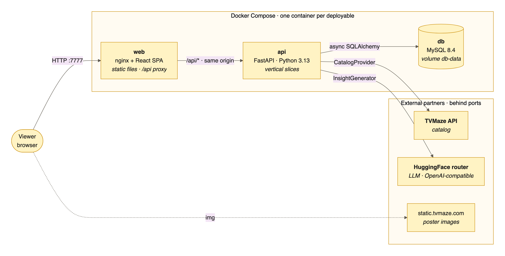
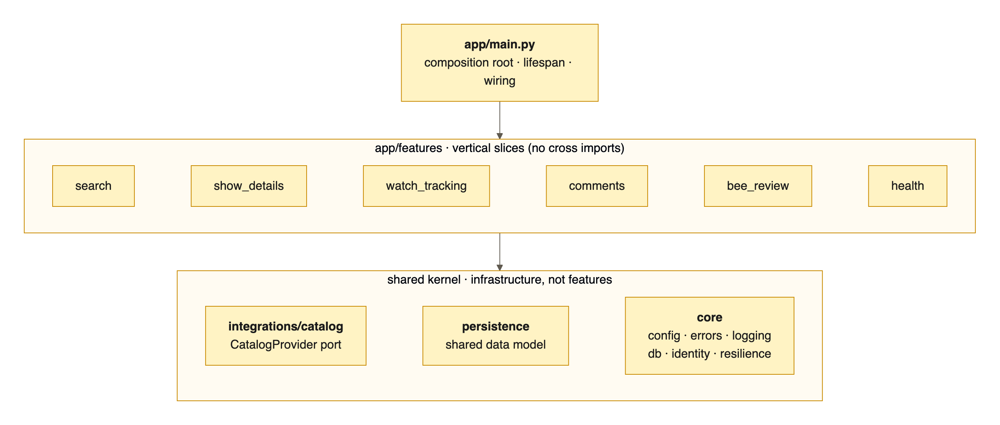
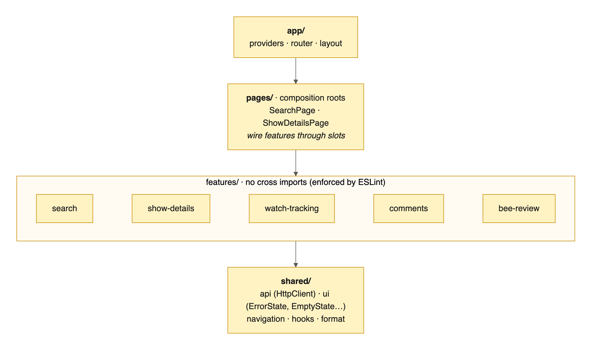
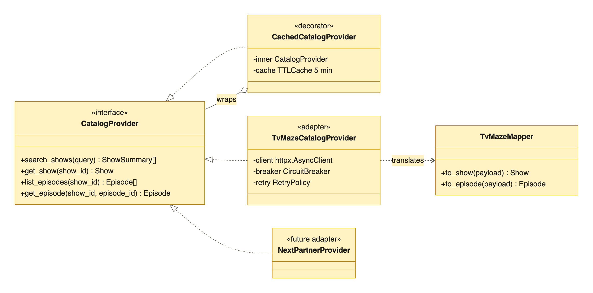
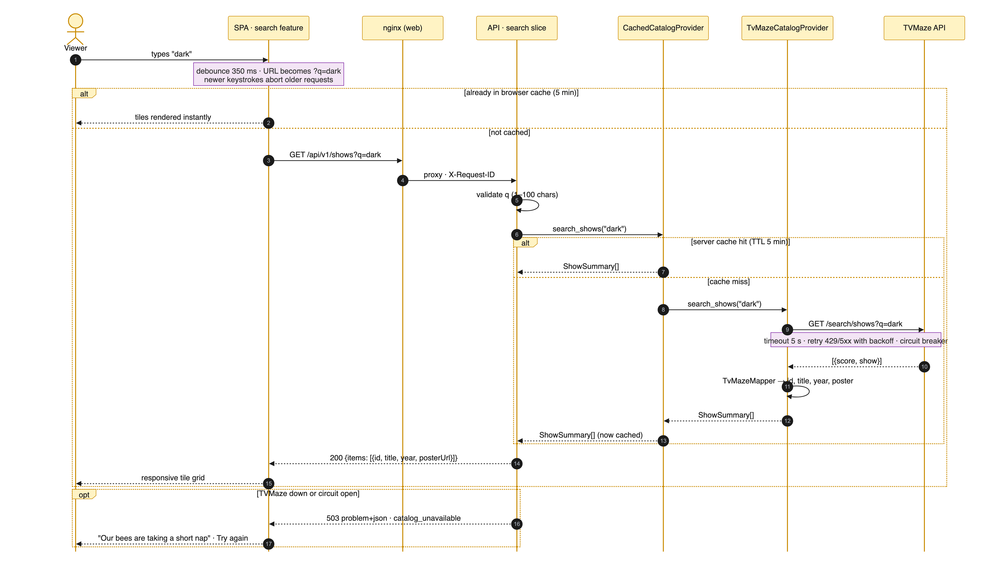
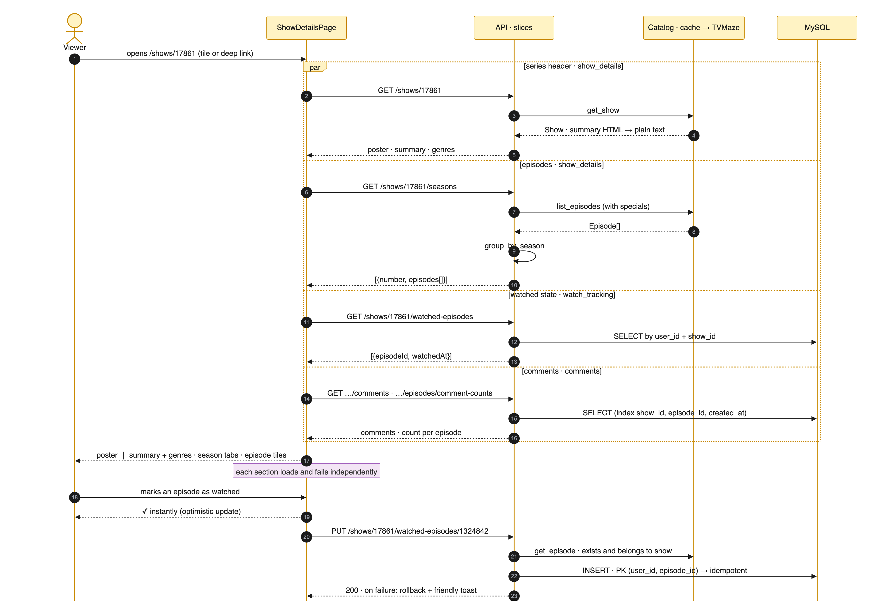
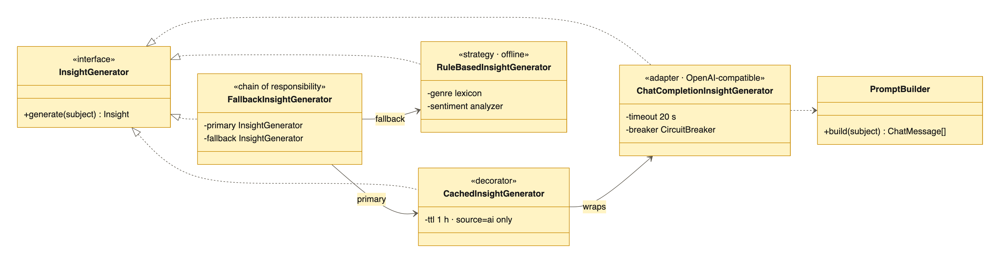
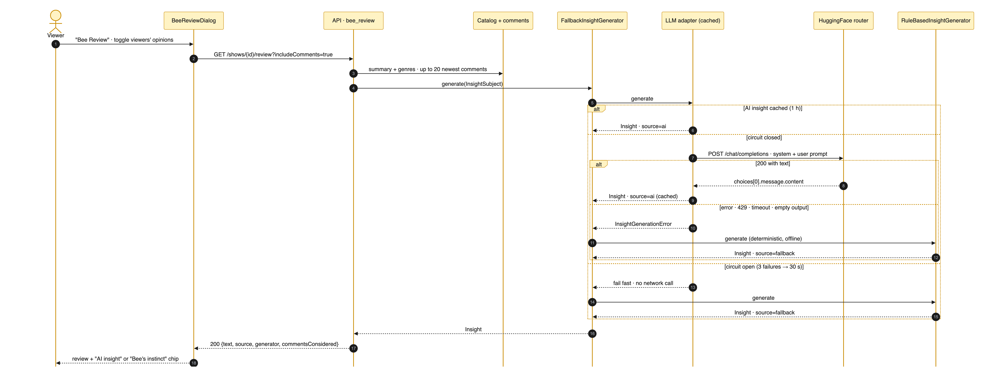
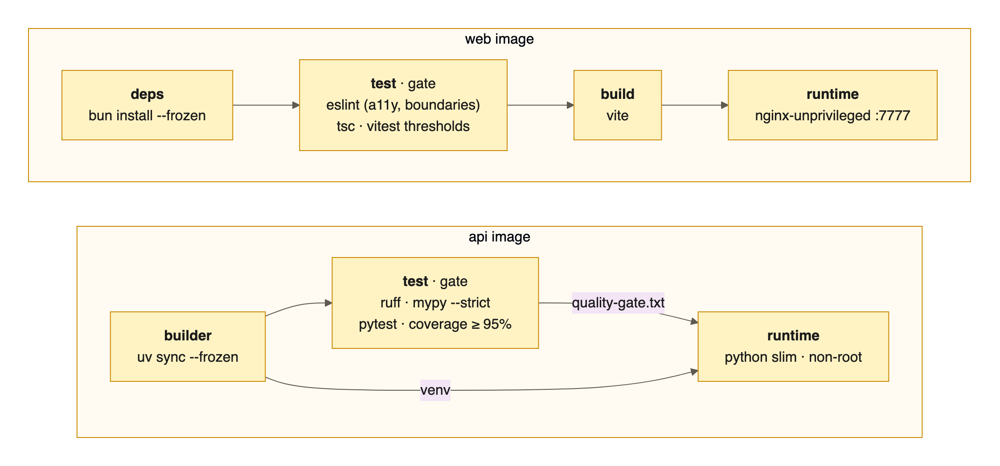

<!--
HOW TO EXPORT TO PDF (the slides render as plain Markdown too):
  • VS Code: install "Marp for VS Code" → open this file → "Export slide deck…" → PDF.
  • CLI (from the repository root):
      npx @marp-team/marp-cli presentation/presentation.md --pdf --allow-local-files
    (--allow-local-files is required for the local images.)
Diagrams are pre-rendered PNGs; edit presentation/diagrams/*.mmd and run
presentation/render_diagrams.py to regenerate them.
HTML comments like this one become speaker notes and are not printed in the PDF.
-->

<!-- _class: lead -->
<!-- _paginate: false -->
<!-- _footer: "" -->

# 🐝 Bee TV

## Interactive TV Series module

**Architecture presentation** · search · series details · watch tracking · comments · AI-powered Bee Review

<!--
Opening: this module is meant to be a technical reference for future teams, so the talk is
about the decisions and their reasoning as much as the features.
-->

---

## Agenda

1. **Context and approach**: specification first, then principles, then decisions
2. **Product tour**
3. **Architectural solution**: tiers, backend slices, frontend features, vendor independence
4. **Information flow**: TV Series Search · Series Details (sequence diagrams)
5. **AI component**: design, runtime flow, fallback strategy
6. **Quality attributes**: resilience, error handling, persistence, testability, DevOps
7. **Trade-offs and roadmap**

---

## Context and approach

- Early-stage streaming platform · **MVP** · the module is a **reference for future teams**
- **Specification first**, before any code:
  - `docs/specification.md`: product features and UI hints
  - `docs/technical-architecture.md`: the principles and drivers (the *macro-decisions*)
  - `docs/patterns-and-choices.md`: every implementation decision traced back to a driver
- Evaluation drivers kept in view the whole time:

| Architecture & design | Code quality | Functionality & stability | AI integration | Testability |
| :---: | :---: | :---: | :---: | :---: |
| 30% | 20% | 30% | 10% | 10% |

<!--
Macro-decisions (drivers) first, micro-decisions (patterns) derived from them. This keeps
decisions consistent and explainable, and patterns-and-choices.md is the audit trail.
-->

---

<!-- _class: diagram center -->

## Product tour: search


<span class="small">Search-engine-style home · results load asynchronously into a responsive tile grid (title, year, poster) · the query lives in the URL</span>

<!--
Demo video: docs/media/bee-tv-intro.mov. Mention the friendly error states (mascot).
-->

---

<!-- _class: diagram center -->

## Product tour: series details


<span class="small">Poster, summary and genres · episodes grouped by season · watched toggles · per-episode comments · <strong>Bee Review</strong> for the series or any episode</span>

<!--
Point at the back link (top-left), the watched progress bar and the "AI insight" vs
"Bee's instinct" label inside the review dialog.
-->

---

<!-- _class: diagram -->

## Architectural solution: two tiers, containerized



<span class="small">One container per deployable · the SPA and the API share **one origin** (nginx proxies `/api`) · partners are reached **only by the backend**, behind ports</span>

<!--
Why same origin: no CORS, and the API and database are never published to the host.
Why backend-only partner calls: caching, rate limits, secrets (HF_TOKEN), vendor independence.
-->

---

## From drivers to decisions

| Driver (specification) | Key decisions |
| --- | --- |
| Vertical Slice Architecture, use cases in handlers | 6 self-contained slices · shared kernel · transaction script per endpoint |
| SOLID · testable and mockable types | Ports (ABC) and adapters · DI via `Depends` · fakes over mocks · injectable clocks |
| Vendor lock-in proof | `CatalogProvider` anti-corruption layer · provider-agnostic models |
| Global exception handlers · per-integration retries | RFC 9457 problem details · retry, circuit breaker and cache chosen per partner |
| Feature folders · design system (MUI) | Lint-enforced boundaries · composition via slots · theme tokens |
| Friendly error UX for unavailability | Error taxonomy → mascot copy · partial degradation · optimistic rollback |
| Single command · tests gate every build | Compose 3.3 · multi-stage images with a **test stage** |

---

<!-- _class: diagram -->

## Backend: Vertical Slice Architecture



- **One folder per capability**: endpoints, DTOs, repository and helpers together; **no slice imports another**
- **Share the data model, not the code**: Bee Review reads comments through its *own* `OpinionSource`
- **Use case in the handler** (transaction script) · pure helpers for logic worth testing (`group_by_season`)

<!--
Shared kernel is infrastructure (config, errors, logging, db, identity, resilience) plus the
catalog port; it is never business logic. Tests mirror the slices.
-->

---

<!-- _class: diagram -->

## Frontend: feature folders, composed by pages

<div class="cols">
<div>



</div>
<div>

- **Layered rule**: `app` → `pages` → `features` → `shared`, never sideways
- **ESLint `no-restricted-imports`** fails the build on a cross-feature import
- **Inversion of Control via slots**: `EpisodeTile` exposes `renderTitleAdornment` and `renderActions`; the page injects the watched toggle, the comments button and Bee Review
- **DI through context**: features use the `HttpClient` interface, never `fetch`
- **Server state** via TanStack Query: key factories, cancellation, optimistic updates

</div>
</div>

---

<!-- _class: diagram -->

## Vendor lock-in proofing: catalog anti-corruption layer

<div class="cols">
<div>



</div>
<div>

- **Port**: `CatalogProvider`, 4 methods (ISP)
- **Adapter**: TVMaze HTTP · **mapper**: TVMaze JSON → Bee TV models
- **Decorator**: TTL cache added at composition time
- **Sanitized**: partner HTML → plain text (XSS-safe UI)
- **Defensive**: ids validated before calling; episode ownership checked
- A new partner = **one new adapter + one factory line**; slices are untouched

</div>
</div>

---

<!-- _class: diagram -->
<!-- _footer: "" -->

## Information flow 1: TV Series Search



<!--
Walk through: debounce and URL, then the browser cache, nginx, validation, server cache,
TVMaze behind retry and breaker, the mapper, and the response. Close with the outage branch
(503, friendly state).
-->

---

## TV Series Search: what the flow guarantees

<div class="cols">
<div>

### Responsiveness
- **Debounce 350 ms**, then the URL `?q=` (shareable, back/forward, bookmarkable)
- **Abort** of outdated requests (`AbortSignal`)
- **Two cache levels**: browser (TanStack Query) and server (TTL 5 min, normalized key)
- Previous results stay visible while refetching, with a thin progress bar

</div>
<div>

### Robustness
- **Edge validation**: `q` 1–100 characters, otherwise `422`
- **TVMaze**: timeout 5 s · 3 attempts with exponential backoff (only 429/5xx/transport) · **circuit breaker**
- Outage: `503` problem+json → *"Our bees are taking a short nap"* + retry
- Responsive, accessible tile grid (`list` semantics, poster `alt`)

</div>
</div>

---

<!-- _class: diagram -->
<!-- _footer: "" -->

## Information flow 2: Series Details



<!--
Four independent requests in parallel, each owned by a different slice. Then the watched
toggle: optimistic in the UI, idempotent PUT backed by a composite primary key.
-->

---

## Series Details: what the flow guarantees

<div class="cols">
<div>

### Composition and data
- **Four slices in parallel**: header, seasons, watched state, comments (with counts)
- `group_by_season`: seasons ascending, specials last, un-numbered episodes by air date
- **Summary HTML → plain text** on the server
- Dedicated URL `/shows/{id}` · deep links · a **back link** to the real previous in-app page

</div>
<div>

### Robustness
- **Sections fail independently**: skeletons and inline errors, not a blank page
- **Watched toggle**: optimistic ✓ · `PUT`/`DELETE` are **idempotent** · rollback + toast on error
- **Existence check** before writes (no orphan rows)
- Race-safe insert: composite PK `(user_id, episode_id)` + `IntegrityError` handling

</div>
</div>

---

<!-- _class: diagram -->

## AI component: design



- **Port** `InsightGenerator`: the rest of the system never knows a model exists
- **Adapter** speaks the **OpenAI-compatible** protocol: HuggingFace, OpenAI, Groq, Ollama or vLLM is a matter of **configuration**
- **Strategy** (LLM or rules) · **Chain of Responsibility** (fallback) · **Decorator** (cache for AI results only)
- **No token configured**: the composition root wires the rule-based strategy only

---

<!-- _class: diagram -->

## AI component: runtime flow and fallback strategy



<span class="small">No retries on the LLM (a fast fallback beats a slow retry) · circuit breaker 3 failures → 30 s · every response states its `source`</span>

---

## AI component: prompt, safety and transparency

<div class="cols">
<div>

### Prompt engineering
- Role: *Bee, the friendly TV critic*
- Constraints: 2–3 sentences, at most 70 words, **only provided facts**
- One-shot tone example (from the brief)
- Inputs: title, genres, summary (≤ 1500 chars), **optional** viewer comments (≤ 20 × 300 chars)

### Safety
- Comments are **delimited and declared untrusted** (prompt-injection mitigation)
- Output normalized and capped (700 chars) · token secret never logged or sent to the browser

</div>
<div>

### Fallback engine (offline, deterministic)
- Genre → phrase lexicon · first sentence of the summary
- Lexicon **sentiment analysis** of comments → *"viewers are mostly enthusiastic (3 comments considered)"*

### Transparency in the UI
- **"AI insight"** chip vs **"Bee's instinct"** chip + caption
- Toggle *"Consider viewers' opinions"* → `includeComments=true`

</div>
</div>

---

## Resilience: chosen per integration, by context

| Integration | Timeout | Retry | Circuit breaker | Cache | Degraded mode |
| --- | --- | --- | --- | --- | --- |
| **TVMaze** | 5 s | 3×, backoff, 429/5xx only | 3 → open 30 s (404 is success) | TTL 5 min | `503 catalog_unavailable` |
| **LLM** | 20 s | **none** (UX, quota) | 3 → open 30 s | AI results, 1 h | Rule-based insight, labeled |
| **MySQL** | driver | startup wait only (30 × 2 s) | n/a | n/a | `503 database_unavailable` · health `degraded` |
| **SPA → API** | browser | queries: 2× for offline/5xx · **mutations never** | n/a | query cache | Friendly error states |

> The circuit breaker **wraps** the retries: one logical call counts once, so a partner outage fails fast instead of piling up slow requests.

---

## Error handling as architecture

<div class="cols">
<div>

### Backend
- Exception **hierarchy with HTTP metadata** (`status`, `code`, `title`) → adding an error never touches a handler (OCP)
- **Global handlers**: application, validation, unknown routes, DB connection (→ 503), catch-all 500 that hides internals
- **Exception translation** at adapters: vendor errors never leak into slices
- **RFC 9457** `application/problem+json`

</div>
<div>

### Frontend
- `classifyError()` → `offline · unavailable · not-found · invalid · unknown`
- Table-driven `ERROR_COPY`: mascot mood, human copy, retryable or not
- `ErrorState` full page / compact inline · toasts for mutations
- **Keep the user's work**: comment draft preserved, optimistic rollback

</div>
</div>

---

## Persistence and schema deployment

<div class="cols">
<div>

### Schema (MySQL 8.4 · utf8mb4)
- `comments`: series or episode scope (`episode_id` nullable) · index `(show_id, episode_id, created_at)`
- `watched_episodes`: PK `(user_id, episode_id)` → **idempotent** · index `(user_id, show_id)`
- Ids as `VARCHAR(64)`: vendor-neutral, no foreign keys to partner data
- `DATETIME(6)` in **UTC**

</div>
<div>

### Deployment
- **Alembic migrations** = schema as code
- Container start: `python -m app.migrate` **waits for MySQL**, then `upgrade head` (idempotent)
- Repository pattern per slice · session per request
- Guest identity via **one dependency**: authentication later touches one function

</div>
</div>

---

<!-- _class: diagram -->

## Testability and the mandatory quality gate



| | Backend (API) | Frontend (App) |
| --- | --- | --- |
| **Tests** | **131** · pytest · unit + integration (ASGI, SQL, migrations) | **122** · Vitest + Testing Library · unit + page flows |
| **Coverage** | ≈ 99% (gate ≥ 95%) | ≈ 99% lines (gate 95/95/95/90) |
| **Static analysis** | Ruff (incl. security rules) · mypy `--strict` | ESLint (typescript-eslint strict, a11y, boundaries) · `tsc` |

<span class="small">No image can be built without passing the gate · fakes instead of mocks · injected clocks · partners faked, so the gate is deterministic</span>

---

## DevOps: everything with one command

```bash
docker compose up --build        # build → test gate → migrate → run  ·  http://localhost:7777
```

<div class="cols">
<div>

- **Compose file format 3.3**: runs on legacy `docker-compose` v1 and on Compose v2/v5
- **Self-healing readiness**: API waits for MySQL; nginx resolves the API per request
- **Health checks** at every level: MySQL ping · `/api/health` (readiness) · `/healthz`

</div>
<div>

- **Multi-stage, non-root images** · frozen lockfiles · only port 7777 published
- **Zero configuration**: every variable has a default; `HF_TOKEN` is optional
- **Edge hardening**: CSP, security headers, immutable asset caching

</div>
</div>

---

## Conscious trade-offs

| Decision | Benefit | Cost / mitigation |
| --- | --- | --- |
| In-process TTL caches | No Redis to operate | Per replica · swap via the decorator seam |
| Migrate on container start | Single command | Single replica only · `BEE_SKIP_MIGRATIONS` + release job to scale |
| Existence check before writes | No orphan rows | Writes return 503 during a catalog outage |
| No retries on the LLM | Fast, predictable UX | Transient blips fall back · AI cache recovers quickly |
| SQLite in the test gate | Fast, hermetic builds | MySQL specifics verified manually · candidate for a compose-level test |
| Mocked guest identity | MVP speed | `user_id` columns and one seam already in place |

---

## Roadmap

- **Identity**: real authentication behind `get_current_user` · per-user data already modeled
- **Scale**: shared cache (Redis) behind the existing decorators · migrations as a release job
- **Catalog**: pagination through the `Page` envelope · a second partner as a new adapter
- **AI**: provider choice per environment · streaming responses · evaluation set for prompt changes
- **Quality**: MySQL-backed integration tests in the pipeline · end-to-end browser tests
- **Operations**: structured JSON logs · metrics (latency, fallback rate, circuit state) · tracing

---

<!-- _class: lead -->
<!-- _paginate: false -->
<!-- _footer: "" -->

# Thank you 🐝

**Questions?**

`docker compose up --build` → http://localhost:7777

Docs: `README.md` · `docs/technical-architecture.md` · `docs/patterns-and-choices.md`
